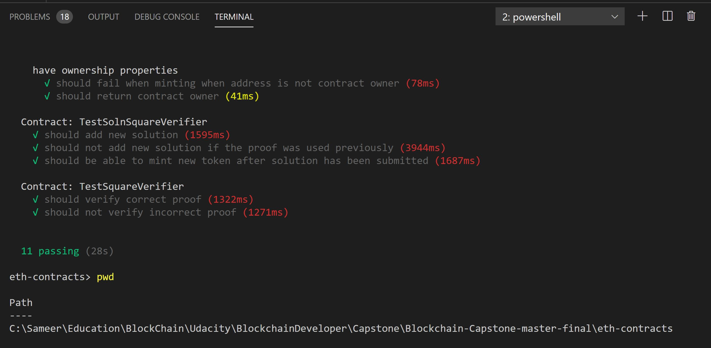
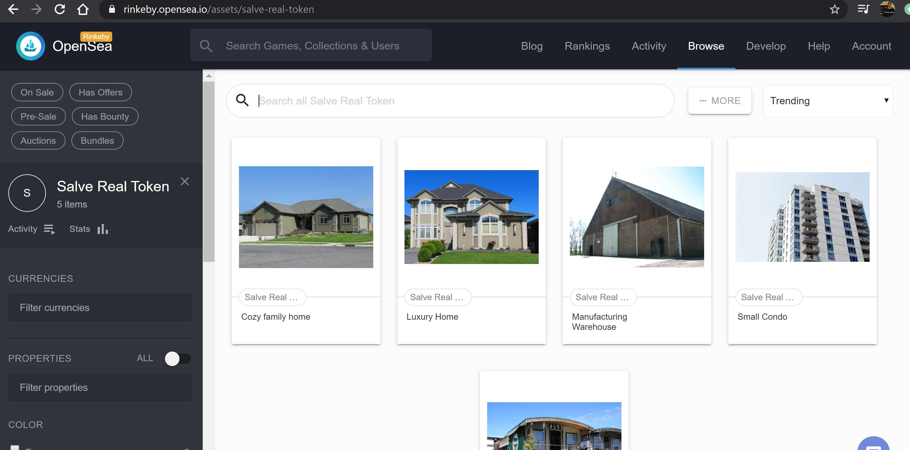

# Udacity Blockchain Developer Nanodegree Program - Capstone: Real Estate Marketplace

The capstone will build upon the knowledge gained in the course in order to build a decentralized housing product.

## Development Environment Version

* Node version number : v8.9.4
* Truffle version number : v5.1.18 (core: 5.1.18)
* Web3 version number : v1.2.1
* Solidity version : v0.5.16 (solc-js)

### Project Implementation

```
npm install
```

Change into the contracts folder:

```cd eth-contracts```

Launch Ganache:

```
ganache-cli -m "frog turtle dice list winter sausage moral fortune tunnel joy open person"
```

In a separate terminal window, compile the smart contracts:

```
truffle compile
```
Migrate smart contracts to the locally running blockchain, ganache-cli:

```
truffle migrate --reset
```

Test the smart contracts:

```
truffle test
```

Truffle Test Output:



Deploy on Rinkeby:

```truffle migrate --network rinkeby --reset```

Smart contracts are deployed on the Ethereum Rinkeby test network:
* SalveRealERC721Token: [```0xad0cb76080F8CAa9Cf1E6EeeB9A182d2828985ac```](https://rinkeby.etherscan.io/token/0xb95a16437e4678ce763d8c2c789bea11d9870dc2?a=0xd57a4b50721bf34df528bb8daa72016d30d27caf)
* SquareVerifier: [```0x4bea2B4Cc65139F70FCC41A36fF16b4909335803```](https://rinkeby.etherscan.io/address/0x4bea2B4Cc65139F70FCC41A36fF16b4909335803)
* SolnSquareVerifier: [```0xb95a16437E4678Ce763d8c2c789bea11d9870dC2```](https://rinkeby.etherscan.io/address/0xb95a16437E4678Ce763d8c2c789bea11d9870dC2)

## Minting ERC721 tokens

Minting Token with ID#1

```
node submit-solution.js ../zokrates/code/square/proofs/1/proof.json 1
```

```
node mint-token.js 1
```

Minting Token with ID#2

```
node submit-solution.js ../zokrates/code/square/proofs/2/proof.json 2
```
```
node mint-token.js 2
```

Minting Token with ID#3

```
node submit-solution.js ../zokrates/code/square/proofs/3/proof.json 3
```
```
node mint-token.js 3
```

Minting Token with ID#4

```
node submit-solution.js ../zokrates/code/square/proofs/4/proof.json 4
```
```
node mint-token.js 4
```

Minting Token with ID#5

```
node submit-solution.js ../zokrates/code/square/proofs/5/proof.json 5
```
```
node mint-token.js 5
```


## OpenSea marketplace

Use the [OpenSea Rinkeby environment](https://rinkeby.opensea.io/get-listed/step-two) to list the SolnSquareVerifier token (```0xb95a16437E4678Ce763d8c2c789bea11d9870dC2```).





## Project Resources

* [Remix - Solidity IDE](https://remix.ethereum.org/)
* [Visual Studio Code](https://code.visualstudio.com/)
* [Truffle Framework](https://truffleframework.com/)
* [Ganache - One Click Blockchain](https://truffleframework.com/ganache)
* [Open Zeppelin ](https://openzeppelin.org/)
* [Interactive zero knowledge 3-colorability demonstration](http://web.mit.edu/~ezyang/Public/graph/svg.html)
* [Docker](https://docs.docker.com/install/)
* [ZoKrates](https://github.com/Zokrates/ZoKrates)
